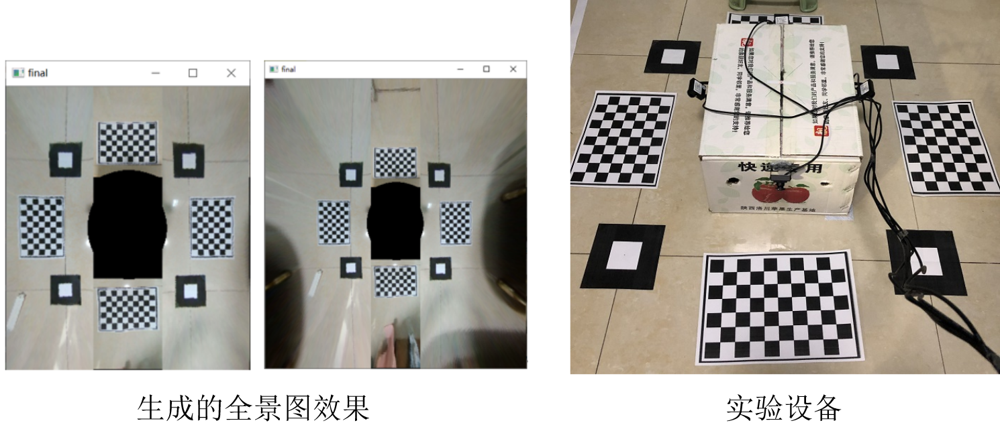
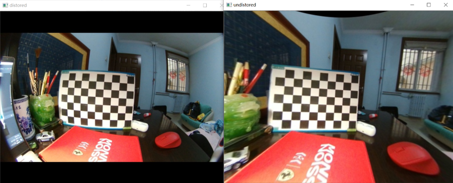
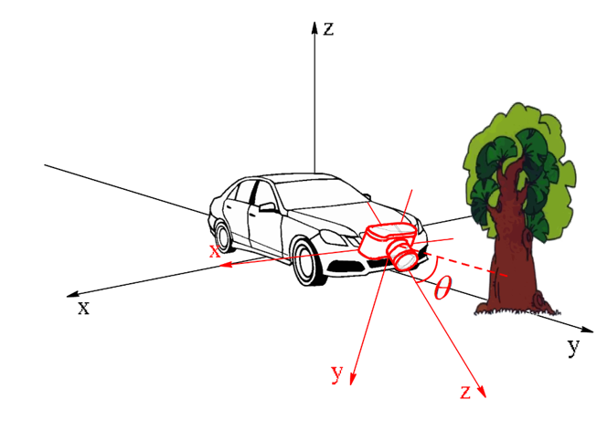
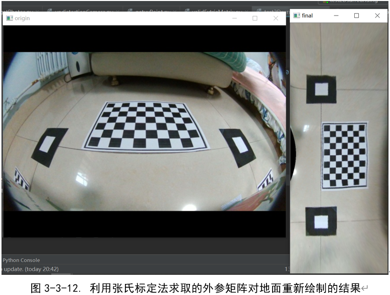
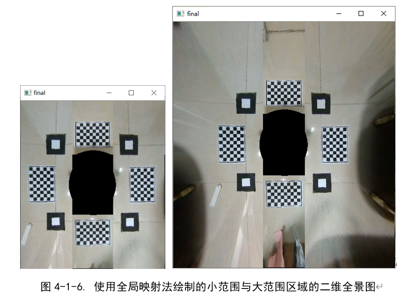
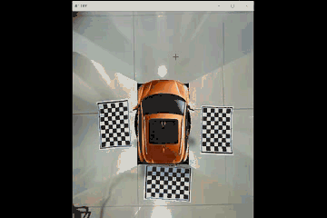

# Python 版本 —— 汽车二维环视系统

## 1. 项目简介

汽车二维全景环视影像系统（鸟瞰影像）利用车身周围安装摄像头所拍摄的图像，通过全景合成算法360度地显示车辆周边环境，从而提高了驾驶安全性与驾驶便捷性。

本项目是利用python版本的OpenCV库，首先利用张正友标定法标定出相机内外参矩阵与畸变参数，其中相机外参需要使用放置在车身四角的标定板标定出，之后对图片做去畸变、透视变化处理，最后合成二维全景图。由于3D版本的全景环视系统需要借助OpenGL实现，但目前无Python版本的库，所以此项目只是实现二维全景图。3D版本的全景环视系统请见我的下一个项目。

## 2. 流程解释

* **鱼眼相机标定：**鱼眼相机除了需要标定普通相机的内参外，还需要标定4个参数进行径向畸变矫正

  
  
  

* **相机外参标定：**外参标定与单相机外参标定不同，由于项目要求需要将4路相机画面拼接成一副完整画面，所以需要选取统一的一个参考系，即世界坐标系。项目中有两种方式标定相机外参方式：

  * 1）通过地面固定的标定板
  * 2）手动输入每个相机相较于世界坐标中心点的偏移和角度

  

  

* **透视变换：**在得到相机外参和相机内参后，即可计算出每个相机拍摄图片中的某个位置应该对应地面（世界坐标系）的哪个位置，以此计算方式计算出4组不共线的对应关系，用于计算每个相机的透视变化矩阵。之后先对相机的画面做畸变校正，之后再使用透视变换矩阵变换成一副“俯视图”。

  

  

* **拼接：**将四路透视变换后的图片拼接在一起。但在实际操作过程中，由于鱼眼相机畸变过大，使用先去畸变再透视变换的处理方法会损失掉大量的图像数据。因而引入了LUT查找表方法，即提前计算好地面上的每点对应的图像中的像素位置，填充像素信息。这种方法可以让俯视图视野扩大很多。

  

  

## 3. 动态演示

使用4路鱼眼相机视频流输入，实时录频效果（不过是使用C++版本的代码，python代码无法做到实时）

